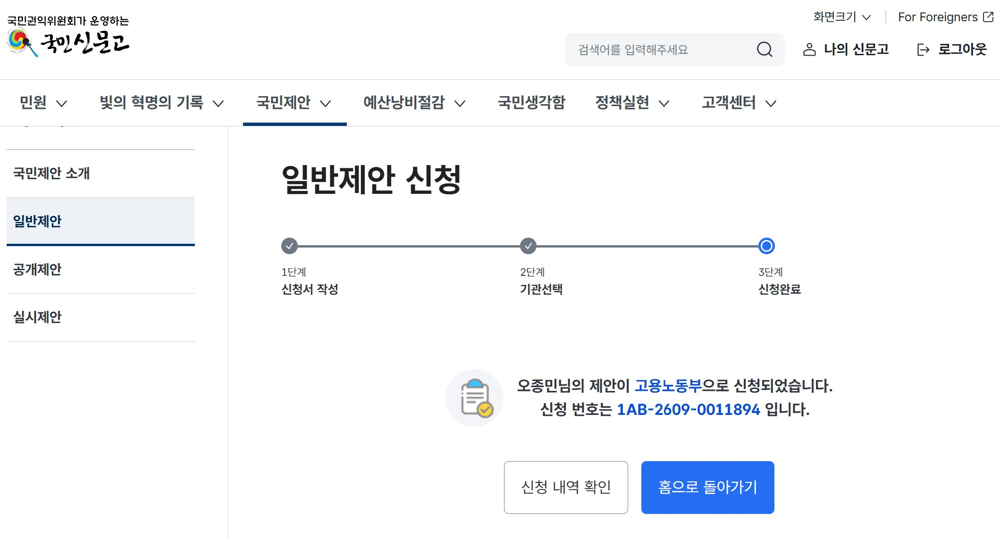

# 고용24 공식 문서를 활용한 근거 기반 실업급여 안내·검색 기능 도입 제안

## 제출 기록

- 제출일: **2026-09-29**
- 제출처: **국민신문고 국민제안**
- 상태: **제안 제출 완료**
- 제안 성격: 고용24 정보 접근성 및 고용센터 상담 업무 지원을 위한 행정서비스 개선 제안
- 제출 문서: [국민신문고 제안서 PDF](제안서.pdf)

### 제안 제출 완료

## 제안 제목

고용24 공식 문서를 활용한 근거 기반 실업급여 안내·검색 기능 도입 제안

## 현황 및 문제점

저는 실업급여를 받는 과정에서 계양 지역 고용센터를 실제로 방문했습니다. 당시 교육을 담당한 강사님께서 복잡한 실업급여 제도와 실업인정 절차를 매우 이해하기 쉽게 설명해 주셨습니다. 함께 제공받은 취업드림수첩도 수급자가 알아야 할 내용이 잘 정리된 좋은 자료라고 생각합니다.

다만 교육을 들은 뒤 집으로 돌아오면 새로운 질문이 생기거나, 들었던 내용을 다시 확인해야 하는 경우가 많았습니다. “온라인 취업특강도 재취업활동으로 인정되는가?”, “단기 근로 소득은 어떻게 신고해야 하는가?”, “계약만료나 권고사직은 수급 자격에 어떤 영향을 주는가?”와 같은 질문입니다.

이러한 내용은 대부분 고용노동부와 법제처의 공식 문서에 포함되어 있지만, 일반 국민이 긴 문서에서 자신의 상황과 관련된 항목을 직접 찾기는 쉽지 않습니다. 법률 용어와 제도 용어가 어렵고, 인터넷 검색에는 과거 기준이나 출처가 불분명한 정보도 함께 노출됩니다. 특히 디지털 활용에 익숙하지 않은 고령자와 제도를 처음 접한 수급자에게는 부담이 더 클 수 있습니다.

결국 국민은 고용센터를 다시 방문하거나 전화로 문의하게 됩니다. 상담을 담당하는 공무원과 직원 역시 반복되는 질문에 답하기 위해 여러 지침과 안내 자료에서 관련 근거를 찾아야 합니다.

본 제안은 현재의 교육이나 취업드림수첩이 부족하다는 취지가 아닙니다. 현장에서 제공되는 좋은 설명과 자료를 국민이 필요할 때 다시 쉽게 찾아볼 수 있게 하고, 안내하는 공무원과 상담 담당자도 공식 근거를 빠르게 확인할 수 있는 보조 기능이 있다면 국민과 담당자 모두에게 도움이 될 것 같아 제안드립니다.

## 개선방안

고용24 또는 고용센터 내부 업무 화면에 **공식 문서 기반 실업급여 안내·검색 기능**을 도입할 것을 제안드립니다.

사용자가 “온라인 취업특강만 들어도 이번 실업인정이 되나요?”처럼 일상적인 표현으로 질문하면, 고용노동부·고용24·법제처의 공식 문서에서 관련 내용을 검색해 쉬운 말로 설명하는 방식입니다.

답변에는 다음 정보를 함께 표시합니다.

1. 답변에 사용한 공식 문서명
2. 문서의 기준일
3. 관련 항목과 페이지 번호
4. 추가 확인이 필요한 경우의 문의처

검색된 문서만으로 판단하기 어려운 개인별 수급 자격이나 예외 사례는 임의로 답변하지 않고, “현재 자료만으로 판단하기 어려우므로 관할 고용센터 또는 1350에서 확인해 달라”고 안내해야 합니다. AI가 수급 여부를 대신 결정하는 것이 아니라, 국민과 담당자가 공식 근거를 빠르게 찾도록 돕는 정보 탐색 보조 기능으로 운영하는 것입니다.

같은 기능을 다음과 같이 국민용과 담당자용으로 함께 활용할 수 있습니다.

- **국민용:** 고용24에서 쉬운 설명과 공식 근거 확인
- **담당자용:** 방문·전화 상담 중 관련 지침과 페이지를 신속하게 검색

저는 가능성을 확인하기 위해 취업드림수첩과 법제처 실업급여 안내 문서 약 100쪽을 이용한 개인 프로토타입을 구현했습니다. 일상적인 질문을 문서 용어로 정리한 뒤 의미 검색과 키워드 검색을 결합해 근거를 찾고, 답변과 함께 문서명·기준일·페이지를 제공합니다. 근거가 부족하면 답변을 거부하도록 설계했습니다.

실제 사용자 질문을 바탕으로 구성한 41문항 평가에서는 다음 결과를 확인했습니다.

- 검색 대상 36문항 모두에서 정답 근거를 하나 이상 검색: **Hit@5 100%**
- 필요한 전체 근거의 상위 5개 내 회수율: **Recall@5 80.7%**
- 답변 또는 거부 판단: **41문항 중 40문항 성공, 97.6%**
- 답변 정확성: **4.17/5**
- 답변 명확성: **4.47/5**

다만 이는 제한된 문서로 만든 개인 프로토타입이므로, 곧바로 행정서비스에 적용하기보다 다음 조건의 소규모 시범운영을 제안드립니다.

- 취업드림수첩과 실업급여 공식 안내 문서로 검색 범위 제한
- 개인정보가 포함되지 않은 일반 제도 질문만 처리
- 최종 수급 판단과 개별 사례 판단은 기존과 같이 담당자가 수행
- 검색 결과와 근거 문서를 담당자가 검토할 수 있도록 제공
- 잘못된 답변, 답변 거부 및 반복 문의 유형을 지속적으로 평가
- 개인정보 보호, 문서 최신화, 보안성과 웹 접근성을 별도로 검토

## 기대효과

### 1. 국민의 정보 접근성 향상

국민은 어려운 법령과 안내문을 일상적인 질문으로 검색하고 쉬운 말로 확인할 수 있습니다. 답변에 문서명·기준일·페이지가 함께 표시되므로 오래된 블로그 정보나 출처가 불분명한 답변에 의존하는 문제도 줄일 수 있습니다.

고용센터 교육을 받은 뒤 기억이 나지 않는 내용이나 새롭게 생긴 질문을 다시 확인할 수 있으며, 문서로 확인 가능한 질문과 담당자 상담이 필요한 질문을 구분하는 데에도 도움이 됩니다.

### 2. 고령자와 디지털 취약계층 지원

긴 문서를 직접 내려받아 필요한 내용을 찾기 어려운 이용자도 질문 형식으로 공식 정보를 확인할 수 있습니다. 큰 글씨, 음성 입력, 쉬운 표현 등의 접근성 기능을 함께 적용한다면 고령 이용자의 정보 접근에도 도움이 될 수 있습니다.

### 3. 상담 담당 공무원과 직원의 업무 지원

방문·전화 상담 중 관련 지침과 문서 페이지를 빠르게 검색할 수 있어 반복적인 문서 탐색 시간을 줄일 수 있습니다. 국민과 담당자가 같은 공식 근거를 확인하므로 상담 내용의 일관성과 신뢰도도 높일 수 있습니다.

단순하고 반복적인 질문은 정보 검색 기능으로 일부 해소하고, 담당자는 개인별 판단이나 복잡한 예외 사례처럼 전문적인 상담이 필요한 업무에 더 집중할 수 있습니다.

### 4. 공식 안내 자료의 활용도 향상

취업드림수첩과 공식 안내 문서는 이미 좋은 정보를 담고 있습니다. 새로운 내용을 임의로 만드는 대신 기존 공식 문서를 더 쉽게 찾고 활용하도록 함으로써 현재 자료의 가치를 높일 수 있습니다.

### 5. 반복 문의를 활용한 안내 개선

어떤 질문이 반복되는지, 어떤 문서가 잘 검색되지 않는지, 이용자가 어느 표현을 어려워하는지 분석하면 취업드림수첩·FAQ·고용24 안내 화면을 개선하는 자료로 활용할 수 있습니다.

본 기능은 기존의 교육, 취업드림수첩, 상담 담당자를 대체하기 위한 것이 아닙니다. 계양 지역 고용센터에서 제가 직접 경험한 이해하기 쉬운 설명과 좋은 안내 자료를 국민이 필요할 때 다시 찾아볼 수 있게 하고, 이를 안내하는 공무원과 직원도 공식 근거를 더 빠르게 확인할 수 있도록 보완하는 기능입니다.

국민과 상담 담당자 모두에게 도움이 될 가능성이 있다고 생각하여, 공식 문서 기반 실업급여 안내·검색 기능의 소규모 시범운영을 검토해 주시기를 제안드립니다.

## 제안의 핵심 원칙

> 공식 안내를 대체하지 않고, 국민과 담당자가 같은 근거를 더 쉽게 다시 찾도록 돕는다.

- 공식 문서만 답변 근거로 사용
- 문서명·기준일·페이지 표시
- 근거가 부족하면 추측하지 않고 상담 연결
- 개인정보 입력과 외부 전송 범위 관리
- 최종 행정 판단은 담당자가 수행
